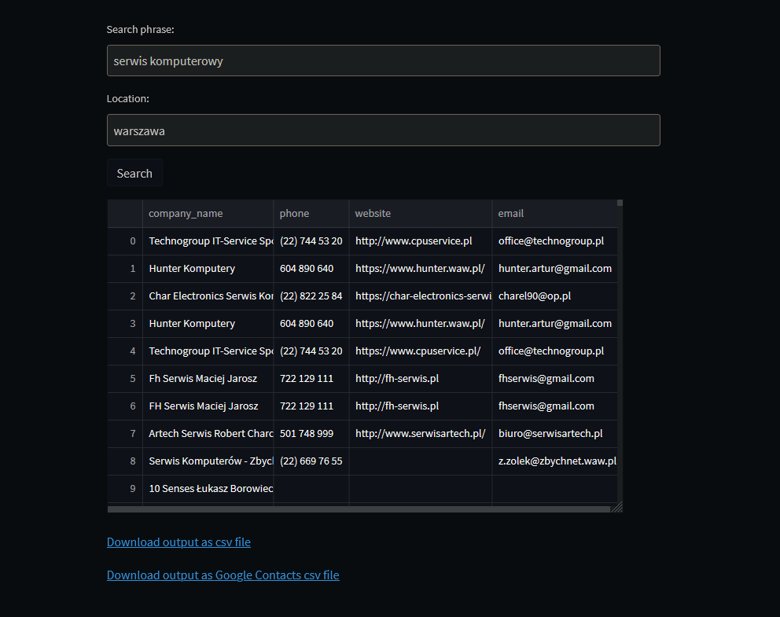
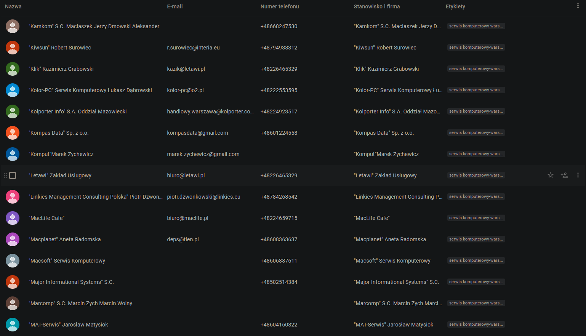

panoramafirm.pl scraper with web UI using Streamlit library.
Script allows user to save scraped data as csv file that can be
imported to Google Contacts, creating contact for each scraped entry.

## Installation
Use git clone to get the library
```shell
git clone https://github.com/michalkulisiewicz/panorama_firm_to_google_contacts.git
```
Install all requirements using pip
```shell
pip install -r requirements.txt
```

# Usage
To run script
```shell
streamlit run main.py
```
Streamlit app should automatically open in default browser if that's not the case 
open browser and go to
```shell
http://localhost:8501
```
**Preview:**



# Importing to Google Contacts
Follow these steps to import script output to Google Contacts:
1. Click on "Download output as Google Contacts csv file" to save csv file.
2. Go to the Google Contacts page.
3. Select Import.
4. Click Select file, choose the file saved in step 1, then click Import.

**Output imported as Google Contacts:**




## Contributing

Bug reports and pull requests are welcome on GitHub at https://github.com/michalkulisiewicz/panorama_firm_to_google_contacts. This project is intended to be a safe, welcoming space for collaboration, and contributors are expected to adhere to the [code of conduct](https://github.com/michalkulisiewicz/panorama_firm_to_google_contacts/blob/master/CODE_OF_CONDUCT.md).

## License

Project is available as open source under the terms of the [MIT License](https://opensource.org/licenses/MIT).

## Code of Conduct

Everyone that interacts in the project codebase, issue trackers, chat rooms and mailing lists is expected to follow the [code of conduct](https://github.com/michalkulisiewicz/panorama_firm_to_google_contacts/blob/master/CODE_OF_CONDUCT.md)
